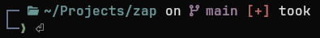

<div align="center">

#  zap

<p align="center">
  <a href="https://github.com/luth9r/zap/blob/main/LICENSE"></a>
  <a href="https://ziglang.org/"></a>
  <a href="#"></a>
  <a href="#"></a>
</p>

**A minimalist, zero-allocation shell prompt written in Zig**

~6 MB RSS · sub-millisecond latency · zero heap allocations on render

<p align="center">
  
</p>

[Documentation](https://luth9r.github.io/zap/) • [Themes](#themes--presets) • [Installation](#installation) • [Shell Setup](#shell-setup) • [Configuration](#configuration) • [License](#license)

</div>

---

## Themes & Presets

Zap comes with customizable themes in the [`examples/themes/`](examples/themes/) directory:

| Theme                | Preview                                                      | Config                                                           |
| :------------------- | :----------------------------------------------------------- | :--------------------------------------------------------------- |
| **Powerline Warm**   |      | [`powerline-warm.toml`](examples/themes/powerline-warm.toml)     |
| **Catppuccin Mocha** |  | [`catppuccin-mocha.toml`](examples/themes/catppuccin-mocha.toml) |
| **Rainbow Pills**    |        | [`rainbow-pills.toml`](examples/themes/rainbow-pills.toml)       |
| **Two-Line Frame**   |      | [`two-line-frame.toml`](examples/themes/two-line-frame.toml)     |
| **Minimal Pure**     |          | [`minimal-pure.toml`](examples/themes/minimal-pure.toml)         |

To try any theme directly:

```bash
ZAP_CONFIG=examples/themes/powerline-warm.toml zap prompt --duration 1200
```

## Installation

### Binaries

Pre-compiled static binaries are available on the [Releases](https://github.com/luth9r/zap/releases) page.

```bash
# Linux x86_64
curl -sSL https://github.com/luth9r/zap/releases/download/v1.0.0/zap-v1.0.0-x86_64-linux.tar.gz | tar -xz
mkdir -p ~/.local/bin && mv zap ~/.local/bin/
```

### Nix (Home Manager)

```nix
# flake.nix
inputs.zap.url = "github:luth9r/zap";

# home.nix
programs.zap = {
  enable = true;
  settings = {
    add_newline = false;
    format = "$directory$git_branch$git_status$character";
    directory.style = "bold cyan";
  };
};
```

### Build from source

Requires **Zig 0.16**:

```bash
git clone https://github.com/luth9r/zap.git
cd zap
zig build -Doptimize=ReleaseFast
cp zig-out/bin/zap ~/.local/bin/
```

---

## Shell Setup

Add the init line to your shell configuration:

### Fish

```fish
# ~/.config/fish/config.fish
zap init fish | source
```

### Zsh

```zsh
# ~/.zshrc
eval "$(zap init zsh)"
```

### Bash

```bash
# ~/.bashrc
eval "$(zap init bash)"
```

### PowerShell

```powershell
# $PROFILE
(&zap init powershell | Out-String) | Invoke-Expression
```

---

## Configuration

zap searches for configuration in `~/.config/zap/config.toml` (or `$ZAP_CONFIG`).

```toml
"$schema" = "https://raw.githubusercontent.com/luth9r/zap/main/zap.schema.json"

add_newline = false
format = "$directory$git_branch$git_status$cmd_duration$character"

[directory]
style = "bold cyan"
truncation_length = 3
truncate_to_repo = true

[git_branch]
symbol = "⎇ "
style = "bold purple"

[git_status]
style = "bold red"

[cmd_duration]
min_time = 2000
style = "bold yellow"

[character]
success_symbol = "[❯](bold green)"
error_symbol = "[❯](bold red)"
```

Full configuration options, module references, styling, and template engine guides are available in the **[Documentation](https://luth9r.github.io/zap/)**.

---

## CLI Commands & Diagnostics

Zap includes a suite of built-in developer tools and diagnostics:

```bash
# Render prompt manually (with custom status / duration)
zap prompt --status 0 --duration 1500 --shell zsh

# Generate shell integration scripts
zap init <bash|zsh|fish|powershell>

# Validate TOML configuration file
zap validate --config ~/.config/zap/config.toml

# List all compiled-in prompt modules
zap list-modules

# Run diagnostics and benchmark rendering speed
zap debug bench                    # 100-iteration benchmark & per-module profile
zap debug git --verbose            # Detailed git status with modified/untracked files
zap debug env                      # Shell, terminal TrueColor, and rc integration checks
zap debug <module> --verbose       # Inspect trigger files and directory scan depth
zap debug all --json               # Output complete diagnostics in JSON format
```

---

## License

[MIT](LICENSE)
